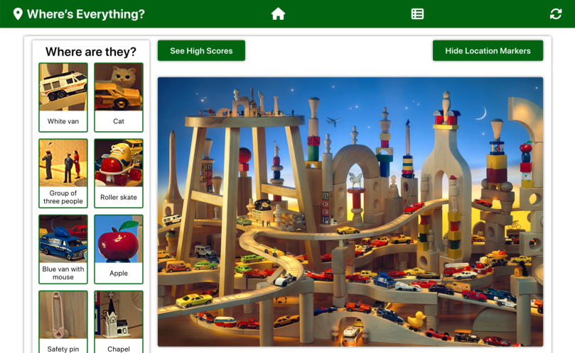

# Where's Everything?

## Introduction

This repository is the front-end for a "Where's Waldo?" game application. It is built using the React framework and bootstrapped with create-react-app.

The "Where's Waldo?" project primarily demonstrates integration of a front-end interface with a back-end API.

## Back End

The back-end repository can be found [here](https://github.com/xsherryhe/wheres-waldo-server).

## Preview

Run this project [here](https://xsherryhe.github.io/wheres-waldo/).

## Image Credits

1) Giphy  
  https://giphy.com/gifs/peAFQfg7Ol6IE

2) Icons 8  
  -Filled fading balls  
  -Circles-menu-3

